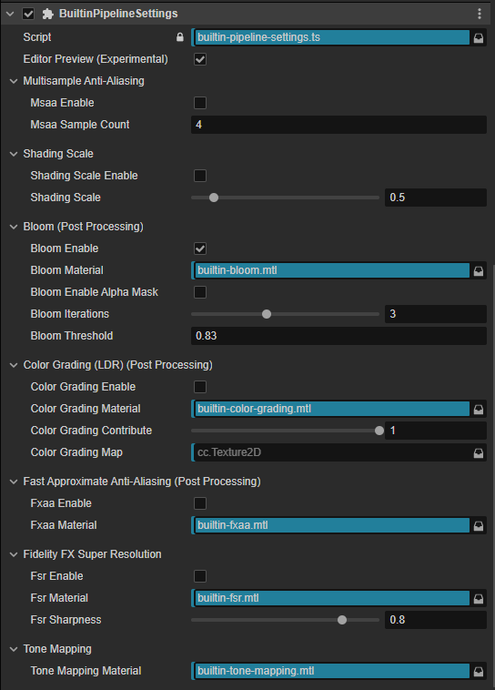

# Using Post-Processing Effects

> **Note**: This document is applicable to users of Cocos Creator v3.8.4 and above. For users of v3.8.3 and below, please refer to the document: [Fullscreen Effect Post-Processing Workflow](./post-process/index.md).

## Adding Components

Every camera in the scene can have a `BuiltinPipelineSettings` component added. `BuiltinPipelineSettings` is used for rendering settings of the current camera, including post-processing effects.

When enabling the corresponding features, you need to attach the required materials and textures, which are generally prefixed with "builtin", as shown in the figure below.

## Multisample Anti-aliasing (MSAA)

Multisample Anti-aliasing (MSAA) is an anti-aliasing technique that eliminates the jagged edges of images by blending samples of different depths during the lighting phase.

Currently supports 2X and 4X multisampling, which is only enabled on native platforms.

On Web platforms, the `antialias` feature of `WebGL` is used, enabled by the `ENABLE_WEBGL_ANTIALIAS` macro.

## Shading Scale

`Shading Scale` is a rendering optimization technique that improves rendering performance by reducing the rendering resolution and thus decreasing the rendering burden.

For example, if the window size is 1920x1080 and the `Shading Scale` is 0.5, the rendering resolution will be 960x540.

It is suitable for scenes with high rendering pressure and can be used in conjunction with super-resolution technology to enhance image quality.

For the UI rendering, the original resolution will be used.

The `Shading Scale` property set on the `BuiltinPipelineSettings` component only affects the current camera.

## Bloom

Bloom is a post-processing effect that enhances the brightness of the image by extracting the bright parts of the image, blurring them, and then superimposing them on the original image.

`Bloom Iterations` is the number of bloom iterations, and `Bloom Threshold` is the bloom threshold value.

## Color Grading

Color Grading is a post-processing effect that adjusts the color effects of the image through a grading map LUT.

## Fast Approximate Anti-aliasing (FXAA)

Fast Approximate Anti-aliasing (FXAA) is an anti-aliasing technique that eliminates the jagged edges of images by smoothing the image.

## FidelityFX Super Resolution (FSR)

FidelityFX Super Resolution is a rendering technique that enhances image quality by reducing the rendering resolution and then improving the image quality through algorithms.

The currently used technology is `AMD FidelityFX Super Resolution`.

It is currently only effective when `Shading Scale < 1`.

## Tone Mapping

Tone Mapping is a post-processing effect that improves the visual effect of the image by adjusting its tonal range.

Currently, Color Grading integrates the Tone Mapping, and if you want to customize it, you need to modify it in conjunction.
