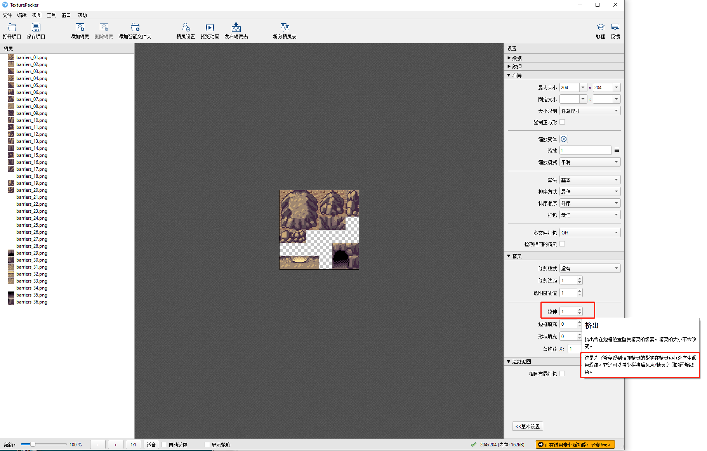
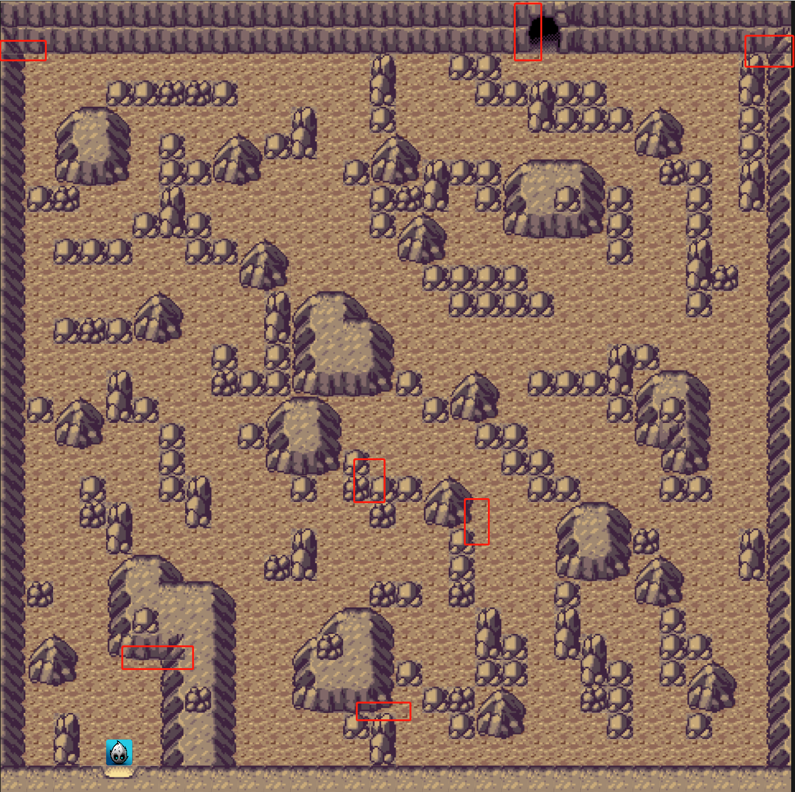
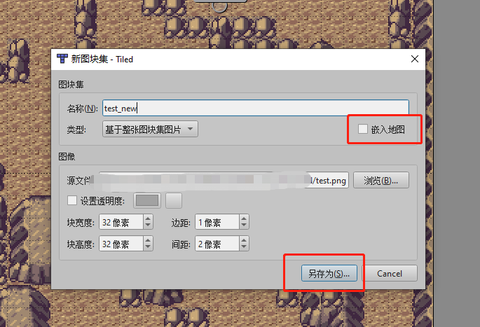

# 瓦片图资源（TiledMap）

## 问题分析
由于使用图集时，如果没有设置1像素的拉伸，会与相邻的图片发生混合，导致边缘颜色不对，例如出现黑边的问题。
因此在制作图集时，需要针对每个图片拉伸一像素作为边缘像素。

引擎之前的实现是自动处理这种问题，会缩进1像素，代码：
```
if (spFrame) {
    grid._name = spFrame.name;
    const lm = spFrame.unbiasUV[0];
    const bm = spFrame.rotated ? spFrame.unbiasUV[1] : spFrame.unbiasUV[5];
    grid.l = lm + (grid.x + 0.5) / texWidth;
    grid.t = bm + (grid.y + 0.5) / texHeight;
    grid.r = lm + (grid.x + grid.width - 0.5) / texWidth;
    grid.b = bm + (grid.y + grid.height - 0.5) / texHeight;
    grid._rect = new Rect(grid.x, grid.y, grid.width, grid.height);
} 
```
但是这样会产生额外的问题，会让UI设计的好地图可能看起来有明显的缩进，类似[issue](https://github.com/cocos/cocos-engine/issues/17257)

为了解决这个问题，在**3.8.5**版本里，我们将移除自动缩进1像素的代码，并且需要需要用户制作图集时，需要设置延伸1像素。

## 制作瓦片贴图的图集
一般需要制作成图集，可以使用[TexturePacker](https://www.codeandweb.com/texturepacker)工具。
- 把素材添加到工具中，如下图：

- 整理导出的图集布局，并设置

**这里需要拉伸1像素，因为相邻的两个纹理如果不拉伸一个像素，使用的时候会出现边缘异常**
- 发布精灵，然后设置保存路径即可


## 使用tiled创建与编辑地图
瓦片图资源是由 [Tiled 编辑器](https://www.mapeditor.org/) 所导出的数据格式。

| Creator 版本  | Tiled 版本 |
| :----------  | :-------- |
| v3.0 及以上   | v1.4   |
| v2.2 及以上   | v1.2.0 |
| v2.1 及以下   | v1.0.0 |

- 创建地图块


- 设置地图块大小


- 新建图集块


- 选择使用上面texturepacker制作的图集


**这里需要设置为要使用原图片的大小，即32X32，并且设置margin为1(图片偏移上下左右1像素)，间距设置为2(左右1像素，就是两个像素，上下也一样)。如果在texturepacker里没设置拉伸，这里就需要设置margin为0，间距设置为0**

- 完成地图，如下图：


- 保存tmx文件


## 导入地图资源

地图所需资源有：

- `.tmx` 地图数据
- `.png` 图集纹理
- `.tsx` tileset 数据配置文件（部分 tmx 文件需要）

    

## 创建瓦片图资源

从 **资源管理器** 里将地图资源拖动到已创建 TiledMap 组件的 Tmx File 属性中：


## 在项目中的存放

为了提高资源管理效率，建议将导入的 `tmx`、`tsx` 和 `png` 文件存放在单独的目录下，不要和其他资源混在一起。需要注意的是要把 `tmx` 文件和 `tsx` 文件放在同一目录管理，否则可能会导致资源无法被正确加载。

### 注意事项
1. 如果在texturepacker不设置拉伸则效果会有偏差

不使用拉伸，效果如下图：

使用拉伸，效果如下图：


2. 如果存在老的图集和地图，可以采用更新图集的方式，不需要重新制作

（1）新增一个新的图集，采用新的配置，注意不要使用嵌入地图


（2）在旧的图集tab里，选择点击替换图集，选择在（1）中新增的图集即可替换成新的图集即可完成更新

