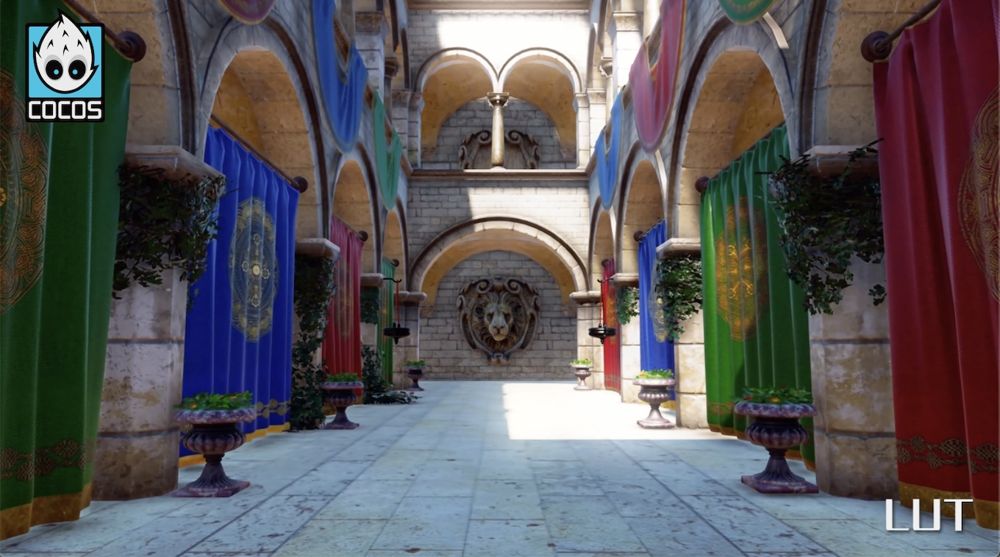

# 渲染管线概述

RenderPipeline 用于控制场景的渲染流程，包括光照管理、物体剔除、渲染物体排序、渲染目标切换等。由于每个阶段对于不同项目来说可以有不同的优化处理方式，所以用统一的方法来处理不同类型项目的渲染流程很难达到最优化的结果。可定制化的渲染管线用于对渲染场景中的每个阶段进行更灵活的控制，可以针对不同的项目做更深层次的优化方案。

Cocos Creator 3.8.4 之后，拥有两套渲染管线：新渲染管线、旧渲染管线。

## 新渲染管线

Cocos Creator 3.8.4 推出了全新的可定制渲染管线，CRP - Customizable Render Pipeline。

全新的可定制渲染管线主要有以下几个好处：

1. Cocos Creator 3.8.4 版本及以上，引擎内置管线基于 CRP 管线构建，使引擎内置管线和用户自定义管线拥有相同的渲染机制和流程，兼容性和稳定性更强。
2. 基于 CRP 管线，开发者能够在不修改引擎源码的情况下编写全平台兼容的渲染流程。
3. 基于 CRP 管线，开发者能够根据项目的需求定制渲染流程，删除不必要渲染过程，节省开销提升性能。
4. 基于 CRP 管线中的 RenderGraph 渲染架构，开发者可以很方便地复用、增加渲染流程，实现项目所需的高级渲染效果和后期效果。

相关文档如下：

- [使用内置渲染管线](./use-builtin-pipeline.md)
- [使用后期效果](./use-post-process.md)
- [编写渲染管线（进阶）](./write-render-pipeline.md)

## 旧渲染管线

旧渲染管线是从 Cocos Creator 3.0 开始，基于传统渲染架构构建的一套渲染管线。

内置了前向渲染、延迟渲染。不支持自定义渲染流程和后期效果。

旧渲染管线会在下一个大版本移除，推荐大家在新项目中使用新渲染管线。

相关文档往下：

- [内置渲染管线-旧](./builtin-pipeline.md)
- [自定义渲染管线-旧](./custom-pipeline.md)
- [后期效果-旧](./post-process.md)

## 新旧渲染管线的兼容机制

1. Cocos Creator 3.8.4+ 新建项目默认管线为新管线
2. 旧项目如果未使用自定义管线，则在升级后使用原渲染管线。
3. 旧项目如果使用了自定义管线，则在升级后使用新渲染管线。
